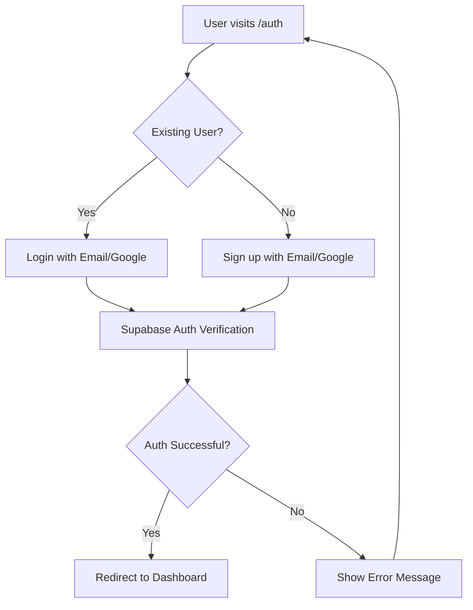
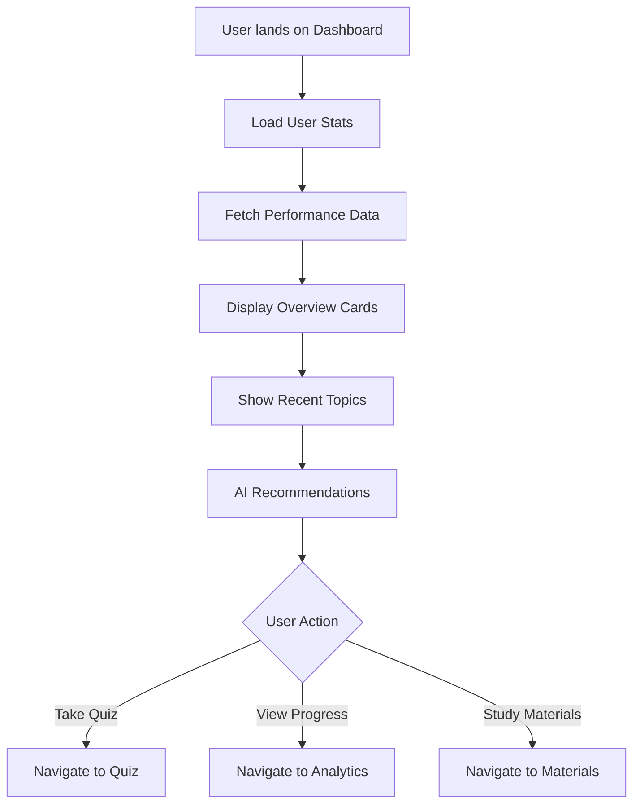
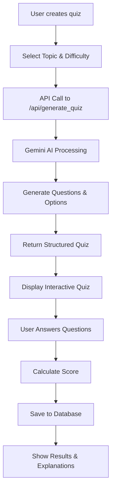
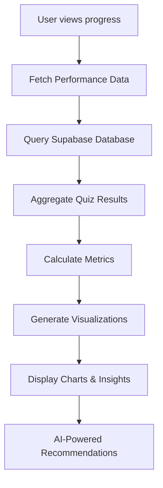
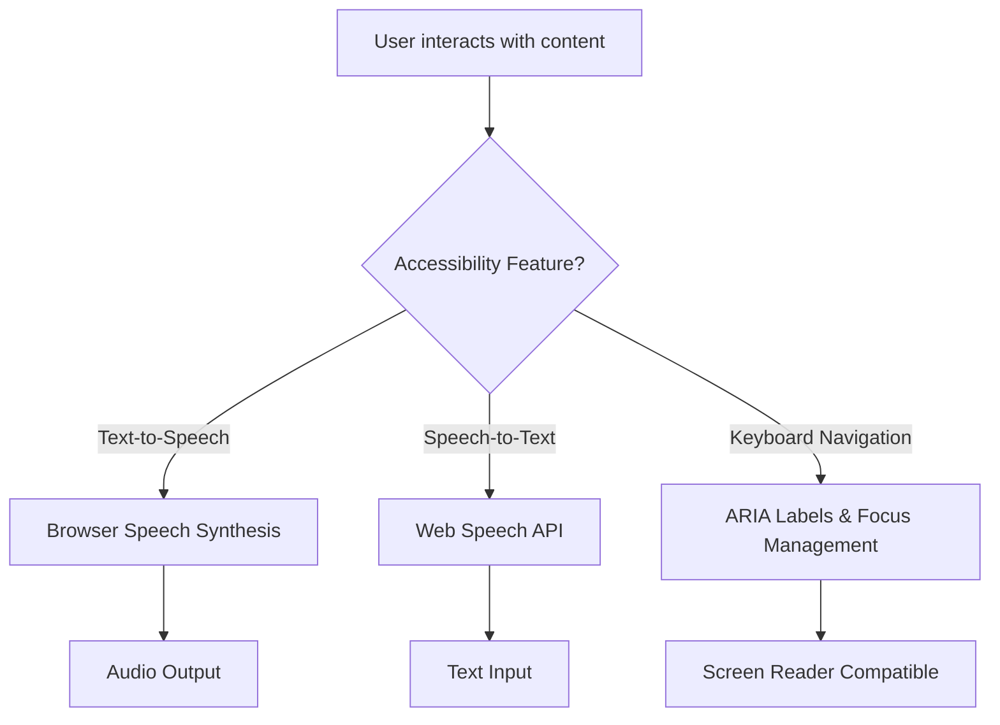

# 🧠 EduSense - AI-Powered Adaptive Learning Platform

## 📋 **Project Overview**

EduSense is a comprehensive AI-powered educational platform that personalizes learning experiences, generates intelligent quizzes, and provides detailed analytics to help students learn more effectively.

## 🏗️ **Architecture & Tech Stack**

### **Frontend (Next.js)**
- **Framework**: Next.js 14 with React 18
- **Styling**: Tailwind CSS for responsive design
- **UI Components**: Lucide React icons
- **Charts**: Recharts for data visualization
- **Authentication**: Supabase Auth with Google OAuth
- **Notifications**: React Hot Toast

### **Backend (Serverless)**
- **Runtime**: Vercel Serverless Functions (Python)
- **AI Engine**: Google Gemini 2.0 Flash API
- **Database**: Supabase (PostgreSQL)
- **Authentication**: Supabase Auth
- **File Storage**: Supabase Storage

### **Key APIs**
- **Quiz Generation**: `/api/generate_quiz.py`
- **Text Simplification**: `/api/simplify_text.py`
- **Learning Paths**: `/api/learning_path.py`
- **Performance Tracking**: `/api/performance.py`

## 🔄 **Application Workflow**

### **1. User Authentication Flow**



**Key Components:**
- `pages/auth.jsx` - Authentication UI
- `contexts/AuthContext.js` - Auth state management
- `pages/auth/callback.js` - OAuth callback handler

### **2. Dashboard Experience**



**Key Features:**
- **Performance Overview**: Total quizzes, average score, study streak
- **Quick Actions**: Direct access to quiz creation, progress, materials
- **Recent Topics**: Last studied subjects with progress bars
- **AI Recommendations**: Personalized suggestions based on performance

### **3. AI-Powered Quiz System**



**Quiz Generation Process:**
1. **Input Validation**: Topic, difficulty, number of questions
2. **AI Prompt Engineering**: Structured prompts for Gemini 2.0 Flash
3. **Response Parsing**: Convert AI response to quiz format
4. **Error Handling**: Fallback questions if AI fails
5. **Interactive UI**: Timer, progress bar, voice features

### **4. Performance Analytics System**



**Analytics Features:**
- **Performance Trends**: Score progression over time
- **Subject Breakdown**: Performance by topic
- **Study Patterns**: Weekly activity and time spent
- **Mastery Levels**: Topic completion percentages
- **AI Insights**: Personalized improvement suggestions

### **5. Accessibility Features**



**Accessibility Implementation:**
- **Text-to-Speech**: Read questions and content aloud
- **Speech-to-Text**: Voice input for answers
- **Keyboard Navigation**: Full keyboard accessibility
- **Screen Reader Support**: ARIA labels and semantic HTML

## 🗄️ **Database Schema**

### **Students Table**
```sql
CREATE TABLE students (
  id UUID PRIMARY KEY DEFAULT gen_random_uuid(),
  user_id UUID REFERENCES auth.users(id),
  full_name TEXT,
  email TEXT,
  grade TEXT,
  subjects TEXT[],
  created_at TIMESTAMP DEFAULT NOW()
);
```

### **Quizzes Table**
```sql
CREATE TABLE quizzes (
  id SERIAL PRIMARY KEY,
  title TEXT NOT NULL,
  description TEXT,
  topic TEXT NOT NULL,
  difficulty TEXT NOT NULL,
  questions JSONB NOT NULL,
  created_at TIMESTAMP DEFAULT NOW()
);
```

### **Performance Table**
```sql
CREATE TABLE performance (
  id SERIAL PRIMARY KEY,
  user_id UUID REFERENCES auth.users(id),
  quiz_id INTEGER REFERENCES quizzes(id),
  topic TEXT NOT NULL,
  difficulty TEXT NOT NULL,
  score INTEGER NOT NULL,
  total_questions INTEGER NOT NULL,
  time_spent INTEGER DEFAULT 0,
  created_at TIMESTAMP DEFAULT NOW()
);
```

## 🤖 **AI Integration Details**

### **Gemini 2.0 Flash API Usage**

**Quiz Generation Prompt Structure:**
```python
prompt = f"""
Create a {difficulty} level quiz about {topic} with {num_questions} questions.

Requirements:
- Questions must be relevant to {topic}
- Each question has exactly 4 options
- correct_answer is the index (0-3) of the correct option
- Include clear, educational explanations
- Ensure questions are appropriate for {difficulty} difficulty

Format as JSON:
{{
    "questions": [
        {{
            "question": "Question text",
            "options": ["A", "B", "C", "D"],
            "correct_answer": 0,
            "explanation": "Why this is correct"
        }}
    ]
}}
"""
```

**AI Features:**
- **Adaptive Difficulty**: Questions adjust based on user performance
- **Topic Variety**: Covers multiple subjects and subtopics
- **Explanation Generation**: Detailed explanations for learning
- **Content Simplification**: Makes complex topics accessible

## 🚀 **Deployment Architecture**

### **Vercel Deployment**
- **Frontend**: Static site generation with Next.js
- **API Routes**: Serverless functions for Python backend
- **Environment Variables**: Secure configuration management
- **Automatic Deployments**: GitHub integration

### **Supabase Integration**
- **Authentication**: User management and OAuth
- **Database**: PostgreSQL with Row Level Security
- **Real-time**: Live data synchronization
- **Storage**: File and media management

## 📊 **Data Flow**

### **Quiz Taking Process**
1. User selects topic and difficulty
2. Frontend calls `/api/generate_quiz`
3. Serverless function queries Gemini AI
4. AI generates structured quiz data
5. Quiz displayed with interactive UI
6. User answers tracked in real-time
7. Results calculated and stored in Supabase
8. Performance metrics updated
9. AI generates personalized recommendations

### **Analytics Generation**
1. User visits progress page
2. Frontend calls `/api/performance`
3. Serverless function queries Supabase
4. Data aggregated and processed
5. Charts and visualizations generated
6. AI insights calculated
7. Personalized recommendations displayed

## 🔧 **Key Features**

### **For Students**
- ✅ **Personalized Quizzes**: AI-generated content based on learning level
- ✅ **Progress Tracking**: Detailed analytics and performance insights
- ✅ **Accessibility**: Voice input/output and screen reader support
- ✅ **Mobile-Friendly**: Responsive design for all devices
- ✅ **Gamification**: Streaks, achievements, and progress visualization

### **For Educators**
- ✅ **Content Creation**: AI-assisted quiz and material generation
- ✅ **Student Analytics**: Comprehensive performance tracking
- ✅ **Curriculum Alignment**: Topic-based learning paths
- ✅ **Difficulty Adaptation**: Automatic adjustment based on performance

### **Technical Excellence**
- ✅ **Serverless Architecture**: Scalable and cost-effective
- ✅ **Real-time Updates**: Live data synchronization
- ✅ **Security**: Row-level security and OAuth authentication
- ✅ **Performance**: Optimized loading and caching
- ✅ **Error Handling**: Graceful fallbacks and user feedback

## 🎯 **Future Enhancements**

### **Planned Features**
- **Video Learning**: Integrated video content with AI transcription
- **Collaborative Learning**: Student groups and peer learning
- **Advanced Analytics**: Predictive modeling for learning outcomes
- **Multi-language Support**: Internationalization
- **Offline Mode**: Progressive Web App capabilities
- **Teacher Dashboard**: Classroom management tools

### **Technical Improvements**
- **Caching**: Redis for improved performance
- **CDN**: Global content delivery
- **Advanced AI**: Fine-tuned models for education
- **Microservices**: Service-oriented architecture
- **Monitoring**: Comprehensive logging and analytics

## 🛠️ **Development Workflow**

### **Local Development**
1. Clone repository
2. Install dependencies (`npm install`)
3. Set up environment variables
4. Configure Supabase project
5. Run development server (`npm run dev`)

### **Deployment**
1. Push to GitHub
2. Vercel auto-deploys
3. Environment variables configured
4. Serverless functions deployed
5. Database migrations applied

This comprehensive workflow ensures a seamless, AI-powered learning experience that adapts to each student's needs while providing educators with powerful insights and tools.
